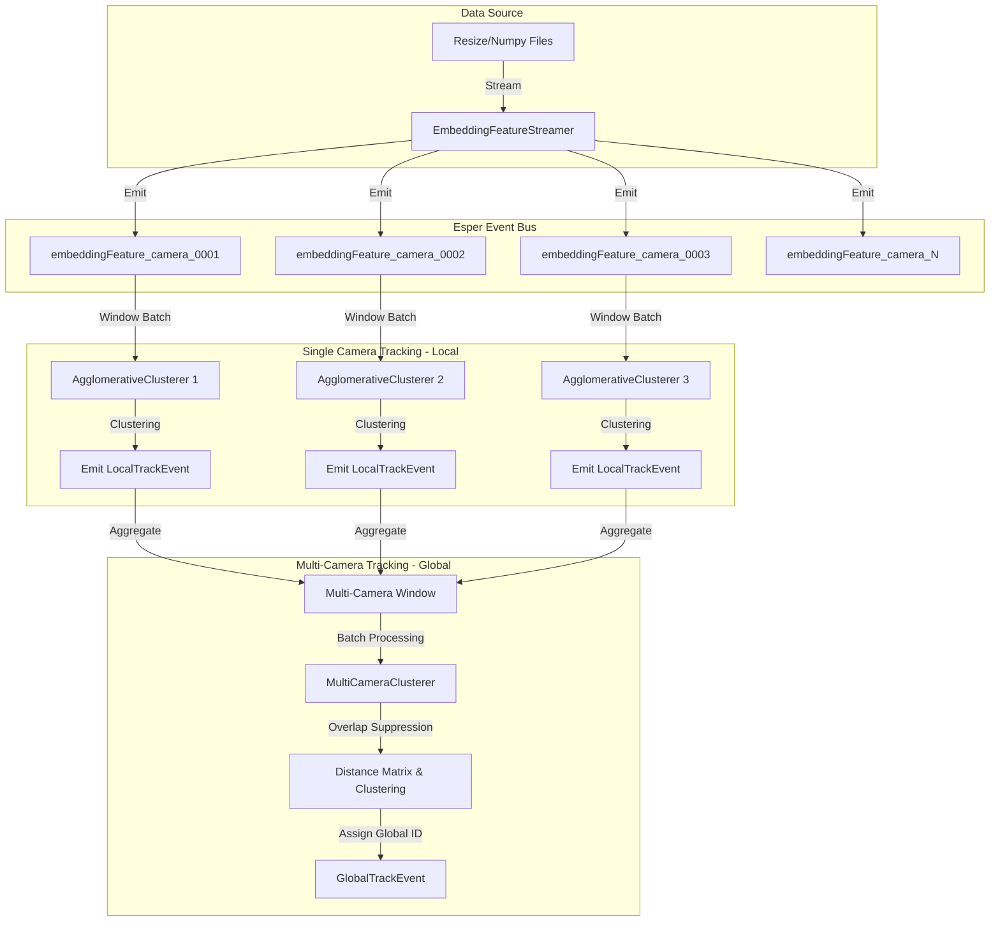

# Overlap Suppression Clustering for Multi-Camera People Tracking

### Real-Time Streaming Implementation

This repository contains a **real-time implementation** of the paper:
**Overlap Suppression Clustering for Offline Multi-Camera People Tracking**

The original offline approach is adapted here to an **online streaming setting** using **Esper** for event processing and **CluStream** for incremental clustering.

## 📌 Overview

This project tackles the problem of tracking people across multiple camera views using real-time feature streams. It adapts the **Overlap Suppression Clustering (OSC)** approach to work in an **online streaming setup**, leveraging:

- 📡 **Esper** for Complex Event Processing (CEP)
- 🔗 **Hierarchical Agglomerative Clustering** for tracklet generation
- ♻️ **Sliding window aggregation** and snapshot queries
- 📁 **.npy feature files** as input streams for each camera and frame

---

## 🏗 System Architecture & Pipeline

The system is built on a hierarchical data processing pipeline powered by the Esper CEP engine. The flow moves from raw data ingestion to local tracking and finally to global multi-camera tracking.



### 1. Data Ingestion Stream
-   **Component**: `EmbeddingFeatureStreamer.java`
-   **Function**: Reads `.npy` feature files frame-by-frame from disk to simulate a real-time feed.
-   **Effect**: Emits `EmbeddingFeature` events into the Esper runtime.
-   **Esper Integration**: Acts as an Event Producer.

### 2. Single Camera Multi-Target Tracking (SCMT)
-   **Goal**: Track individuals within a single camera view.
-   **Esper Technology Used**:
    -   **`win:length_batch(...)`**: A sliding window that collects a batch of events (e.g., 30 frames) for a specific camera.
    -   **Listeners**: An instance of `AgglomerativeClusterer` is attached as a listener to this window.
-   **Clustering**: The `AgglomerativeClusterer` processes the batch, clusters detections based on feature similarity (cosine distance), and creates "Tracklets".
-   **Output**: Emits a `LocalTrackEvent` containing the tracklet's average features and time range.

### 3. Multi-Camera Multi-Target Tracking (MCMT)
-   **Goal**: Identify the same person across multiple cameras.
-   **Esper Technology Used**:
    -   **Event Aggregation**: All cameras emit `LocalTrackEvent`s to a common stream.
    -   **`win:time_batch(...)`**: A global time-based window that collects all tracklets from all cameras over a specific period (e.g., 1 second).
    -   **Decoupling**: This allows cameras to operate asynchronously while the central processor handles synchronization.
-   **Overlap Suppression Logic**:
    -   The `MultiCameraClusterer` receives the batch of global tracklets.
    -   It calculates a distance matrix between all tracklets.
    -   **Crucial Step**: If two tracklets are from the **SAME camera**, their distance is set to `Infinity` (Overlap Suppression). This enforces the rule that a single camera cannot see the same person as two different tracks simultaneously.
    -   **Clustering**: Standard Hierarchical Clustering merges tracklets from *different* cameras with similar features.

---

## 💡 Key Technology & Implementation Details

### Why Esper CEP?
This architecture improves upon the original offline pipeline by enabling **Stream Processing**:
1.  **Event-Driven**: The system reacts to data arrival rather than iterating through static files.
2.  **Windowing**: Esper's powerful windowing capabilities (`win:time_batch`, `win:length_batch`) handle the temporal grouping of data automatically, replacing complex manual indexing.
3.  **Real-Time capable**: The pipeline processes data in small batches as it flows, making it suitable for live deployment.

### 🔍 Detailed Feature Lifecycle & Data Flow

You asked: *How exactly are features tracked? Do we table them? Do we join streams?*

Here is the exact lifecycle of a feature vector through the system:

1.  **Raw Ingestion (No Table)**
    -   **Source**: `.npy` file on disk.
    -   **Action**: `EmbeddingFeatureStreamer` reads it and wraps it in an `EmbeddingFeature` object.
    -   **Flow**: Pushed immediately to the `embeddingFeature_camera_X` stream.
    -   *Note: No database table is used. The "storage" is the transient event stream.*

2.  **Local Aggregation (Window Buffering)**
    -   **Mechanism**: Esper's `win:length_batch(N)` holds the last `N` raw events in memory for each camera.
    -   **Transformation**: When the window is full (e.g., 30 frames), `AgglomerativeClusterer` activates.
    -   **Clustering**: It groups similar raw features into a **Cluster**.
    -   **Feature Update**: It calculates the **MEAN (Average)** feature vector for that cluster.
    -   **Emission**: This new, cleaner feature vector is wrapped in a `LocalTrackEvent` and emitted.
    -   *Crucial Point*: We don't re-stream the raw data. We stream a **new, higher-level object** (`LocalTrackEvent`) representing the "Tracklet".

3.  **Global Joining (Stream Convergence)**
    -   **Mechanism**: A single Esper window `LocalTrackEvent.win:time_batch(1 sec)` acts as the **Join Point**.
    -   **Logic**: It creates a "Pool" or "bucket" that catches `LocalTrackEvent` objects dropped by *any* camera in the last second.
    -   **Action**: `MultiCameraClusterer` looks at this pool. It doesn't need to query a table; it just iterates over the list of events currently in the window.
    -   **Matching**: It uses the features inside these `LocalTrackEvent` objects to compute the distance matrix and assign Global IDs.

---

## 🛠 Technologies used

| Component       | Description                        |
| --------------- | ---------------------------------- |
| **Java**        | Core implementation language       |
| **Esper**       | Complex Event Processing (CEP) engine for stream management |
| **Smile**       | Machine Learning library used for **Hierarchical Clustering** |
| **NumPy**       | `.npy` embedding files (input format) |
| **Maven**       | Build & dependency management      |

---

## 🧩 Build System & Environment

- **Build system**: Maven  
- All dependencies are resolved automatically via `pom.xml`
- **IDE**: IntelliJ IDEA
- Tested and verified on:
  - **Ubuntu 24.04**
  - **Windows 11**

---

## 📦 Building the Project

```bash
mvn clean install
```

---

## ▶️ Running the Project

### Using Terminal Scripts (Recommended)
You can run the project directly from the terminal using the provided scripts. These scripts use Maven to manage dependencies and bypass checkstyle for a smooth run.

#### Windows (Command Prompt)
```cmd
.\run_project.bat
```

#### Windows (PowerShell)
```powershell
.\run_project.ps1
```

### Manual Run with Maven
Alternatively, you can use Maven's `exec:java` goal:
```bash
mvn exec:java -Dexec.mainClass="com.espertech.esper.example.IOT.IotMain" -Dexec.args="--scene 1 --features_dir Examples/EmbedFeature --camera 0001 --output_dir ./outputs/scene1" -Dcheckstyle.skip
```

For multi Camera:

```bash
mvn exec:java "-Dexec.mainClass=com.espertech.esper.example.IOT.IotMain" "-Dexec.args=--scene 1 --features_dir Datasets/EmbedFeature --exec_all" 
```

For Visualizations:

```bash
python visualize_tracking.py  --json-dir ./tracking_results/camera_0001  --frames-dir c:/OURs/Thesis/Original/scene_001  --output-dir ./visualized_tracking/camera_0001  --camera-id camera_0001  --create-video
```


---

## 🔧 Program Arguments

| Argument         | Description                                      | Default     |
| ---------------- | ------------------------------------------------ | ----------- |
| `--scene`        | **(Required)** Scene number (e.g., 1, 2, 3)      | -           |
| `--features_dir` | Base directory for embedding features            | -           |
| `--camera`       | Camera number (e.g., 0001, 0002) or `all`        | `all`       |
| `--output_dir`   | Directory to save logs and outputs               | `./output`  |
| `--exec_all`     | Execute all tracking stages (SCPT and MCPT)      | (Enabled)   |
| `--exec_scpt`    | Execute only Single-Camera People Tracking       | -           |
| `--exec_mcpt`    | Execute only Multi-Camera People Tracking        | -           |

### Example Arguments
```text
--scene 1 
--features_dir C:\OURs\Thesis\Datasets\EmbedFeature 
--camera 0001 
--output_dir ./outputs/scene1
```

---

## 📂 Dataset Structure

```text
dataRoot/
 ┣ scene_001/
 ┃ ┣ camera_0001/
 ┃ ┃ ┣ 000001.npy
 ┃ ┃ ┣ 000002.npy
 ┃ ┣ camera_0002/
 ┃ ┃ ┣ 000001.npy
 ┃ ┃ ┣ 000002.npy
```


## 📚 Reference

**Overlap Suppression Clustering for Offline Multi-Camera People Tracking**
